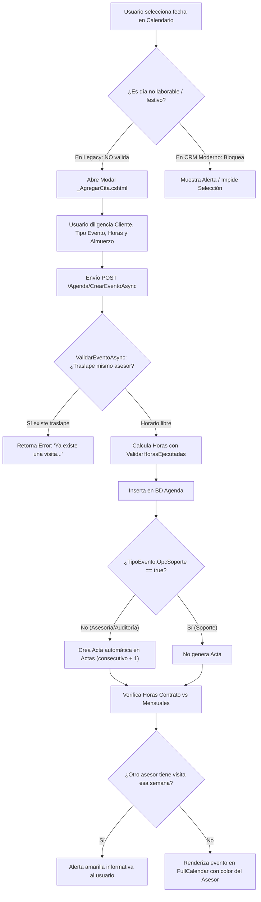
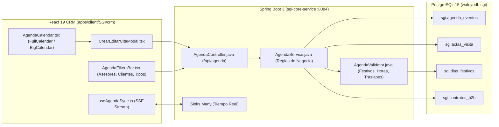

# 📅 Especificación Técnica y Catálogo de Escenarios: Módulo de Agenda SGI (Legacy a CRM Moderno)

---

## 1. Localización del Código Fuente Legacy

| Capa | Archivo Fuente Legacy | Responsabilidad Central |
|---|---|---|
| **Controlador MVC** | [`AgendaSGI/Web/Controllers/AgendaController.cs`](file:///D:/Waloyo/WaloyoGroup/apps/client/AgendaSGI/Web/Controllers/AgendaController.cs) | Endpoints HTTP, orquestación de llamadas de negocio, serialización JSON para FullCalendar y manejo de sesiones. |
| **Lógica de Negocio (BLL)** | [`AgendaSGI/CoreBusiness/AgendaCoreBusiness.cs`](file:///D:/Waloyo/WaloyoGroup/apps/client/AgendaSGI/CoreBusiness/AgendaCoreBusiness.cs) | Validaciones de traslape, cálculo de horas ejecutadas, descuento de hora de almuerzo, cruces entre asesores. |
| **Lógica de Actas** | [`AgendaSGI/CoreBusiness/ActasCoreBusiness.cs`](file:///D:/Waloyo/WaloyoGroup/apps/client/AgendaSGI/CoreBusiness/ActasCoreBusiness.cs) | Creación automática de acta de visita (`GuardarActaAsync`) con consecutivo autoincremental por cliente. |
| **Lógica de Reportería** | [`AgendaSGI/CoreBusiness/InformesCoreBusiness.cs`](file:///D:/Waloyo/WaloyoGroup/apps/client/AgendaSGI/CoreBusiness/InformesCoreBusiness.cs) | Comparativo mensual de horas ejecutadas acumuladas vs. horas contratadas (`GetHorasContratoVSHorasMensuales`). |
| **Frontend JavaScript** | [`AgendaSGI/Web/Scripts/modulos/Agenda/CRUDAgenda.js`](file:///D:/Waloyo/WaloyoGroup/apps/client/AgendaSGI/Web/Scripts/modulos/Agenda/CRUDAgenda.js) | Renderizado de FullCalendar v4, drag & drop, redimensionamiento, modales dinámicos y peticiones AJAX. |
| **Vistas Razor** | [`AgendaSGI/Web/Views/Agenda/`](file:///D:/Waloyo/WaloyoGroup/apps/client/AgendaSGI/Web/Views/Agenda/) | `Index.cshtml`, `_AgregarCita.cshtml`, `_GetEvento.cshtml`, `_GetCalendario.cshtml`, `TiemposAsesorias.cshtml`. |
| **Modelo ORM** | [`AgendaSGI/Models/Agenda.cs`](file:///D:/Waloyo/WaloyoGroup/apps/client/AgendaSGI/Models/Agenda.cs) | Entidad `Agenda` mapeada a la tabla `Agenda` de la BD `gestioni_datosNet`. |

---

## 2. Mapa Completo de Escenarios y Reglas de Negocio

---

### ESCENARIO 1: Creación de Nuevo Evento (`CrearEventoAsync`)
- **Disparador UI**: Clic o arrastre de selección en celdas vacías del calendario (`select` en `CRUDAgenda.js`).
- **Endpoint**: `POST /Agenda/CrearEventoAsync`
- **Parámetros recibidos**:
  - `IntClienteID`: Empresa cliente asignada.
  - `IntTipoEventoID`: Categoría (Capacitación, Asesoría, Inspección, Auditoría, Soporte).
  - `DatFechaInicial` y `DatFechaFinal`: Rango de fecha y hora.
  - `OpcAllDay`: Booleano para eventos de jornada completa.
  - `OpcLunch`: Booleano indicando si incluye hora de almuerzo.
  - `StrDescripcion`: Notas u observaciones de la visita.
- **Reglas y Validaciones**:
  1. **Validación de fechas**: `DatFechaFinal` debe ser estrictamente posterior a `DatFechaInicial`.
  2. **Validación de traslape del Asesor (`ValidarEventoAsync`)**:
     - Se consulta la base de datos buscando eventos activos (`OpcCancelada == false`) del mismo asesor (`IntUsuarioID == session.ID`).
     - Si hay intersección de rangos: retorna `RecursoAgenda.msnEventoYaExiste` ("Ya cuenta con una visita programada en este horario").
  3. **Cálculo de Horas de Asesoría (`ValidarHorasEjecutadas`)**:
     - Si `TipoEvento.OpcSoporte == true`, las horas se registran como `"0"` (el soporte no gasta bolsa de horas).
     - Si dura menos de 1 día: `horas = (FechaFinal - FechaInicial).TotalHours - (OpcLunch ? 1 : 0)`.
     - Si dura varios días: computa las jornadas laborales diarias según `StrHoraInicial` y `StrHoraFinal` de `Configuracion`, descontando almuerzos.
  4. **Creación Automática de Acta de Visita (`_actasCoreBusiness.GuardarActaAsync`)**:
     - Si no es soporte, consulta el último `IntConsecutivo` del cliente y crea un registro en la tabla `Actas` vinculado a `IntAgendaID`.
  5. **Control de Presupuesto de Horas de Contrato (`GetHorasContratoVSHorasMensuales`)**:
     - Suma todas las horas ejecutadas del cliente en el mes.
     - Si `HorasEjecutadas >= Contrato.IntHoras`, retorna mensaje de advertencia: `"El cliente ha superado el número de horas contratadas para este mes"`.
  6. **Alerta de Coexistencia de Asesores en la Misma Semana (`ValidarSiOtroAsesorProgramoEventoConCliente`)**:
     - Si `TipoEvento.OpcAlerta == true`, revisa si otro consultor programó una visita al mismo cliente en la misma semana y genera una advertencia descriptiva: *"El cliente X ya tiene visita de Y programada esa semana con [Asesor Z]"*.

---

### ESCENARIO 2: Edición y Actualización de Eventos (`UpdateEventoAsync`)
- **Disparador UI**: Clic sobre un evento existente en el calendario (`eventClick` $\rightarrow$ `GetEvento(id)` $\rightarrow$ modal `_GetEvento.cshtml`).
- **Endpoint**: `POST /Agenda/UpdateEventoAsync`
- **Reglas de Seguridad y Edición**:
  1. **Propiedad de la cita**: Un asesor solo puede editar citas donde `IntUsuarioID == usuarioSession.IntUsuarioID`, a menos que tenga rol `admin`.
  2. **Bloqueo por Acta Tramitada (`OpcEnviado`)**: Si `OpcEnviado == true` (el acta de visita ya fue firmada/enviada al cliente), el evento pasa a **modo solo lectura** (`editable: false`).
  3. **Re-validación de Horas y Traslape**: Si se modifica la hora, se revalida que no colisione con otras citas y se recalculan las horas computadas.

---

### ESCENARIO 3: Reprogramación Directa en Calendario (`UpdateEventoDropResizeAsync`)
- **Disparador UI**: 
  - **Drag & Drop** (`eventDrop`): Arrastrar la tarjeta de un día/hora a otro día/hora.
  - **Resize** (`eventResize`): Estirar o encoger la duración del evento desde el borde inferior de la tarjeta.
- **Endpoint**: `POST /Agenda/UpdateEventoDropResizeAsync`
- **Reglas**:
  - Si el evento se desmarca de todo el día y no tiene hora final, se le asigna 1 hora de duración por defecto.
  - Recalcula automáticamente `StrHoras` con `ValidarHorasEjecutadas`.
  - Verifica si con el nuevo horario se excede la bolsa de horas del contrato mensual.

---

### ESCENARIO 4: Cancelación de Eventos (`CancelarEventoAsync`)
- **Disparador UI**: Botón "Cancelar Visita" en el detalle de la cita.
- **Endpoint**: `POST /Agenda/CancelarEventoAsync`
- **Comportamiento**:
  - **Soft-Cancel**: No borra el registro de la tabla `Agenda`. Setea `OpcCancelada = true`.
  - **Liberación de Horas**: Asigna `StrHoras = "0"` para que deje de sumarizar en el consumo mensual del contrato.
  - **Feedback Visual**: En el calendario cambia el color de fondo del asesor a gris `#ACACAC` y desactiva su capacidad de edición.

---

### ESCENARIO 5: Eliminación Física (`DeleteEventoAsync`)
- **Disparador UI**: Botón "Eliminar" (restringido a administradores o eventos no tramitados).
- **Endpoint**: `POST /Agenda/DeleteEventoAsync`
- **Comportamiento**: Ejecuta borrado físico en BD (`DELETE FROM Agenda WHERE IntAgendaID = @id`). Requiere validar que no existan actas o firmas asociadas con llave foránea estricta.

---

### ESCENARIO 6: Check-In de Asistencia en Sitio (`MarcarHoraDeLlegadaAsync`)
- **Disparador UI**: Botón en la aplicación móvil/web al llegar a las instalaciones del cliente.
- **Endpoint**: `POST /Agenda/MarcarHoraDeLlegadaAsync`
- **Comportamiento**:
  - Guarda la marca de tiempo exacta del servidor convertida a hora local Colombia en el campo `DatFechaIngreso`.
  - Alimenta la auditoría de puntualidad y cumplimiento del asesor en el informe de tiempos de asesoría.

---

### ESCENARIO 7: Filtros Dinámicos Multicriterio (`GetAllProgramacion`)
- **Disparador UI**: Selectores laterales del panel de agenda (Checkboxes de asesores, clientes y tipos de evento).
- **Endpoint**: `POST /Agenda/GetAllProgramacion`
- **Comportamiento**:
  - Filtra por rango visible (`DatFechaInicial >= inicio || DatFechaFinal > final`).
  - Aplica filtros en memoria/BD si el usuario desmarca ciertos asesores o clientes.
  - Asigna dinámicamente el color corporativo del asesor (`StrColor`) o gris `#ACACAC` si está cancelada.

---

### ESCENARIO 8: Matriz de Tiempos de Asesoría (`TiemposAsesoriasAsync`)
- **Disparador UI**: Pestaña "Informe de Tiempos de Asesoría" (`TiemposAsesorias.cshtml`).
- **Endpoint**: `POST /Agenda/GetTiemposAsesoriasAsync`
- **Comportamiento**: Compara hora pactada de inicio vs. `DatFechaIngreso` (hora real de llegada) por cliente y asesor.

---

### ESCENARIO 9 (REQUERIMIENTO NUEVO): Bloqueo por Días Festivos y No Laborables
- **Problema en Legacy**: No existía; permitía agendar en feriados y fines de semana.
- **Comportamiento Requerido para el Nuevo CRM**:
  1. **UI**: Deshabilitar en el calendario los días no laborables (festivos colombianos + fines de semana) impidiendo el clic o arrastre.
  2. **Backend**: Validar contra la tabla `sgi.dias_festivos` antes de persistir, retornando excepción de negocio amigable si se intenta forzar la fecha.

---

## 3. Plan de Arquitectura y Migración al CRM Moderno (React 19 + Spring Boot)

### Componentes a Construir en el Nuevo CRM:
1. **Sustitución del `iframe`**: Reemplazar el contenedor iframe de [`AgendaView.tsx`](file:///D:/Waloyo/WaloyoGroup/apps/client/SGI/crm/src/pages/AgendaView.tsx) por una vista nativa React 19 con integración FullCalendar v6 o BigCalendar.
2. **Servicio Reactivo en Backend**: Extender [`com.waloyo.sgi.controller.AgendaController.java`](file:///D:/Waloyo/WaloyoGroup/apps/client/SGI/sgi-core-service/src/main/java/com/waloyo/sgi/controller/AgendaController.java) con la capa `AgendaService` que aplique exactamente las reglas de negocio aquí documentadas.
3. **Manejo Nativo de Festivos**: Inyectar el catálogo de feriados colombianos 2026/2027 en PostgreSQL para deshabilitar fechas automáticamente.
