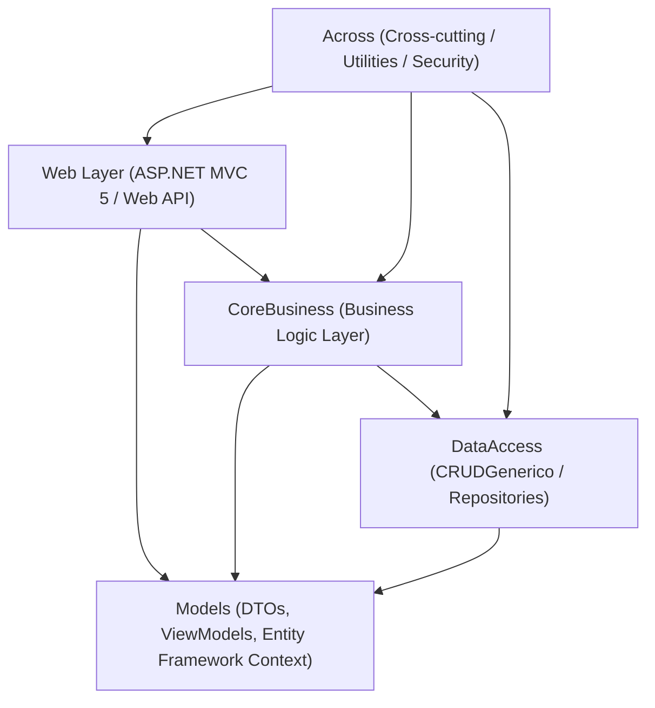
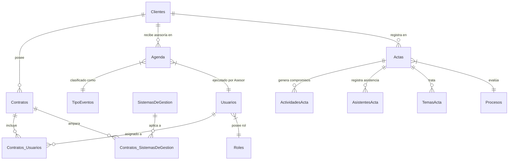

# 📘 Documentación Técnica y Modelo de Datos — AgendaSGI (Legacy)

---

## 1. Resumen del Sistema

**AgendaSGI** es la solución legacy de planificación operativa y gestión de consultorías de **Gestión Integral SGI S.A.S.** Desarrollada en **C# .NET Framework v4.7.2** bajo una arquitectura multicapa (N-Tier / Clean Architecture) con base de datos Microsoft SQL Server mediante Entity Framework.

El objetivo central de `AgendaSGI` es controlar el ciclo completo de la asesoría B2B:

1. Asignación de asesores/consultores a clientes por contrato.
2. Programación de agenda en calendario (eventos de acompañamiento, capacitaciones, inspecciones, auditorías).
3. Diligenciamiento de **Actas de Visita/Asesoría**.
4. Seguimiento de **Actividades y Compromisos derivados de las Actas**.
5. Generación de informes de gestión e indicadores de tiempos de asesoría.

---

## 2. Arquitectura de la Solución Visual Studio (`SGI.sln`)

### Proyectos en la Solución C#:

- **`Web`**: Capa de presentación ASP.NET MVC 5. Contiene controladores, vistas Razor, recursos estáticos y configuración de ruteo.
- **`CoreBusiness`**: Capa de lógica de negocio. Reglas de validación de agenda, cálculo de horas de asesoría, notificaciones y flujos de actas.
- **`DataAccess`**: Capa de acceso a datos con patrón repositorio genérico (`CRUDGenerico.cs`) y Entity Framework (`datosNetModel`).
- **`Models`**: Definición de entidades ORM, modelos de contexto de base de datos (`datosNetModel.edmx`) y Data Transfer Objects (DTOs).
- **`Across`**: Utilidades transversales (encriptación, helpers de formato, gestión de logs de excepciones `LogsEx.cs`).

---

## 3. Modelo de Datos Relacional (Entidades Principales)

### Diccionario de Tablas / Entidades:

| Entidad / Tabla | Propósito & Campos Clave | Relaciones Clave |
|---|---|---|
| **`Clientes`** | Almacena el directorio de empresas clientes B2B (`Id`, `NIT`, `RazonSocial`, `Direccion`, `Telefono`, `CiudadId`, `Estado`). | `FK_Ciudades`, `1:N Contratos`, `1:N Agenda`, `1:N Actas`. |
| **`Agenda`** | Eventos del calendario de asesoría (`Id`, `FechaInicio`, `FechaFin`, `AsesorId`, `ClienteId`, `TipoEventoId`, `Estado`, `Observaciones`). | `FK_Usuarios (Asesor)`, `FK_Clientes`, `FK_TipoEventos`. |
| **`Actas`** | Registros oficiales de visita técnica de consultoría (`Id`, `Consecutivo`, `Fecha`, `ClienteId`, `AsesorId`, `ProcesoId`, `Conclusiones`, `FirmaAsesor`, `FirmaCliente`). | `FK_Clientes`, `FK_Usuarios`, `FK_Procesos`, `1:N ActividadesActa`, `1:N AsistentesActa`, `1:N TemasActa`. |
| **`ActividadesActa`** | Tareas y compromisos acordados en las actas (`Id`, `ActaId`, `DescripcionTarea`, `Responsable`, `FechaLimite`, `EstadoCompromiso`). | `FK_Actas`. |
| **`AsistentesActa`** | Personal del cliente o consultoría asistente a la reunión (`Id`, `ActaId`, `NombreAsistente`, `Cargo`, `Correo`). | `FK_Actas`. |
| **`TemasActa`** | Puntos del orden del día tratados (`Id`, `ActaId`, `Tema`, `Desarrollo`). | `FK_Actas`. |
| **`Contratos`** | Contratos de servicios B2B vigentes (`Id`, `ClienteId`, `NumeroContrato`, `FechaInicio`, `FechaFin`, `ValorContrato`, `Estado`). | `FK_Clientes`, `1:N Contratos_SistemasDeGestion`, `1:N Contratos_Usuarios`. |
| **`SistemasDeGestion`** | Catálogo de normas y sistemas (`Id`, `NombreSistema`: SG-SST, ISO 9001, ISO 14001, ISO 45001, PESV). | `1:N Contratos_SistemasDeGestion`. |
| **`Usuarios`** | Usuarios del sistema (`Id`, `NombreUsuario`, `Correo`, `ClaveHash`, `RolId`, `Estado`). | `FK_Roles`, `1:N Agenda`, `1:N Actas`. |
| **`Roles` & `Roles_Modulos`** | Control de acceso basado en roles (RBAC: Admin, Asesor, Cliente, Auditor). | `FK_Modulos`. |
| **`TipoEventos`** | Categorías de la agenda (Auditoría, Inspección, Capacitación, COPASST, Revisión). | `1:N Agenda`. |

---

## 4. Controladores y Endpoints Principal (`Web/Controllers`)

- **`AgendaController.cs`**:
  - `GetEventosFullCalendar()`: Retorna eventos formateados para la librería FullCalendar en JS (`EventosFullCalendarDTO.cs`).
  - `GuardarEvento()` / `ActualizarEvento()`: Creación y edición de citas de agenda con validación de traslape de horarios por asesor.
- **`ActasController.cs`**:
  - `CrearActa()`: Formulario de captura de visitas con firma digitalizada del cliente y asesor.
  - `GenerarPDFActa()`: Renderizado de informe formal de visita en formato imprimible.
- **`ActividadesController.cs`**:
  - `GetCompromisosPendientes()`: API para alimentar el tablero de compromisos de actas.
  - `CerrarCompromiso()`: Actualiza estado a completado con soporte de evidencias.
- **`ClientesController.cs`**:
  - `GetClientesActivos()` / `CRUD`: Gestión del directorio corporativo.
- **`InformesController.cs`**:
  - `GetTiemposAsesorias()`: Reporte consolidado de horas ejecutadas vs. contratadas por cliente (`TiemposAsesoriasDTO.cs`).

---

## 5. Estrategia de Migración a la Arquitectura Waloyo (Spring Boot + React 19)

Para la migración futura del backend `AgendaSGI` hacia la **Arquitectura Híbrida de 5 Capas de Waloyo Group**:

1. **Persistencia (SQL Server $\rightarrow$ PostgreSQL)**:
   - Mapear las tablas `Clientes`, `Agenda`, `Actas`, `ActividadesActa` y `Contratos` a la base de datos PostgreSQL en Docker.
2. **Backend Services (C# .NET $\rightarrow$ Java Spring Boot Hexagonal)**:
   - Crear el microservicio `sgi-agenda-service` en Spring Boot.
   - Implementar el dominio hexagonal desacoplado de frameworks ORM.
3. **Autenticación (ASP.NET Auth $\rightarrow$ Keycloak SSO)**:
   - Reemplazar la tabla `Usuarios`/`Roles` por el servidor Keycloak OIDC de Waloyo.
4. **Frontend (ASP.NET Razor $\rightarrow$ React 19 CRM)**:
   - Conectar los endpoints REST del backend Spring Boot con el módulo frontend `apps/client/SGI/crm` (Vite + React 19).

---

> **Documentado por Waloyo Group Tech Governance** — *Tecnología resiliente. Operación continua.*
