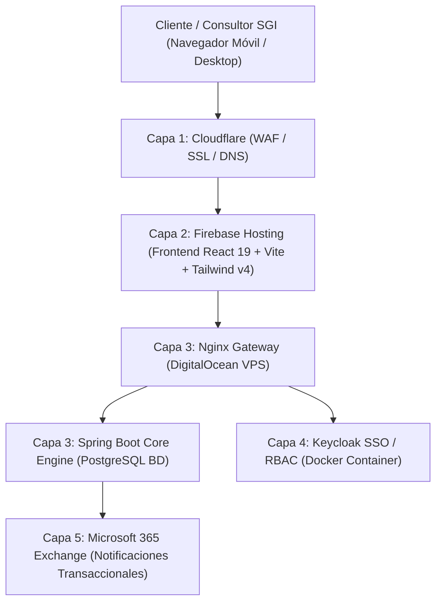

# 🏛️ Documento de Arquitectura y Estrategia de Migración — Gestión Integral SGI

---

## 1. Visión General de la Arquitectura

El subproyecto **Gestión Integral SGI** adopta la **Arquitectura Híbrida Desacoplada de 5 Capas** de Waloyo Group para garantizar resiliencia, alta disponibilidad y escalabilidad comercial B2B.

---

## 2. Mapa de Capas e Infraestructura

### Capa 1: Orquestación Perimetral & WAF (Cloudflare)
- **Dominios**: `gestionintegralsgi.com.co` / `consultorsgi.com`
- **Responsabilidad**: Certificados SSL/TLS, protección anti-DDoS, optimización de DNS y proxy inverso primario.

### Capa 2: Frontend Estático (Firebase Hosting)
- **Stack**: React 19, Vite 6, TypeScript 5, Tailwind CSS v4.
- **Distribución**: CDN Global ultrarrápida con despliegues automatizados vía GitHub Actions (`.github/workflows/cd.yml`).

### Capa 3: Motor Transaccional / Backend Core (DigitalOcean VPS)
- **Tecnología Backend**: Java Spring Boot (Arquitectura Hexagonal) / Node.js.
- **Base de Datos**: PostgreSQL en contenedor Docker aislado.
- **Microservicios**:
  - `AgendaSGI API`: Gestión de programaciones de asesores, clientes y estados de servicio.
  - `ConsultorSGI API`: Módulo documental de auditorías (generación de informes PDF y listas de chequeo).

### Capa 4: Autenticación & Control de Acceso (Keycloak)
- **Protocolos**: OAuth 2.0 / OpenID Connect (OIDC).
- **Roles**:
  - `ADMIN`: Acceso total a administración.
  - `ASESOR`: Vista de agenda propia, diligenciamiento de actas y listas de chequeo.
  - `CLIENTE`: Visualización del avance PHVA de su sistema de gestión.
  - `AUDITOR_EXTERNO`: Acceso restringido al módulo de auditorías asignadas.

### Capa 5: Comunicaciones Transaccionales (Microsoft 365)
- Integración vía API de Microsoft Graph / SMTP Seguro con los correos oficiales (`asesorias@gestionintegralsgi.com.co`, `direccion@consultorsgi.com`).

---

## 3. Plan de Desacoplamiento de la Suite Legacy

### Legacy Identificado (`D:\Waloyo\WaloyoGroup\apps\client\SGI\`)
1. **`AgendaSGI`**: Monolito C# ASP.NET MVC (`SGI.sln`).
2. **`ConsultorSGI`**: Monolito C# ASP.NET MVC (`ConsultorSGI.sln`) con base de datos SQL Server (`BD_2022-08-25.bak`).

### Estrategia de Migración Gradual (Patrón Strangler Fig)
- **Fase 1 (Completada)**: Maquetación y despliegue del portal comercial estático B2B en React 19 / Vite.
- **Fase 2**: Extracción de DTOs y esquemas de base de datos desde SQL Server a la estructura relacional de PostgreSQL.
- **Fase 3**: Migración de la lógica de agenda y asignación de asesores al motor de backend en Java Spring Boot.
- **Fase 4**: Migración del generador de informes de auditoría en PDF e integración de Keycloak para los roles de usuario.

---

> **Waloyo Group Tech Governance** — *Resiliencia Dinámica.*
