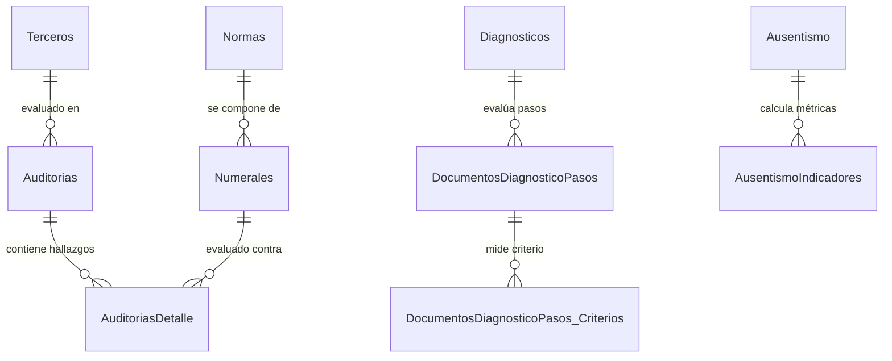

# 📘 Documentación Técnica y Modelo de Datos — ConsultorSGI (Legacy)

---

## 1. Resumen del Sistema

**ConsultorSGI** es el software técnico especializado de auditoría, evaluación de estándares mínimos y seguimiento de indicadores de **Gestión Integral SGI S.A.S.** Desarrollado en **C# ASP.NET MVC 5** con arquitectura multitabla en **Microsoft SQL Server**.

El objetivo central de `ConsultorSGI` es la auditoría técnica de cumplimiento normativo en Colombia:
1. **Evaluación de Estándares Mínimos SG-SST** (Resolución 0312 de 2019 / Decreto 1072 de 2015).
2. **Auditorías de Sistemas de Gestión de Calidad (ISO 9001:2015)**, Ambiental (ISO 14001:2015) y Salud Ocupacional (ISO 45001:2018).
3. **Planes de Acción y Listas de Chequeo / Verificación**.
4. **Módulo de Ausentismo Laboral e Indicadores de Accidentalidad**.

---

## 2. Mapa de Módulos y Controladores C# (`ConsultorSGI/Web/Controllers`)

| Módulo / Controlador | Descripción & Funcionalidad Técnica |
|---|---|
| **`AuditoriasController.cs`** | Gestión de auditorías de 1ª, 2ª y 3ª parte. Asignación de equipo auditor, fecha de campo, objetivos y alcance. |
| **`AuditoriasDetalleController.cs`** | Diligenciamiento del hallazgo por numeral de la norma (Conformidad, No Conformidad Mayor/Menor, Oportunidad de Mejora). |
| **`DiagnosticosController.cs`** | Evaluación diagnóstica del ciclo PHVA (Planear, Hacer, Verificar, Actuar) para la empresa cliente. |
| **`DocumentosDiagnosticoPasosController.cs`** | Evaluación de los 60 estándares mínimos de la Res. 0312/2019 estructurados por pasos y criterios de verificación. |
| **`ListasDeVerificacionController.cs`** | Creación y ejecución de listas de chequeo personalizadas por sector económico. |
| **`AusentismoController.cs` & `AusentismoIndicadoresController.cs`** | Registro de incapacidades médicas, accidentes de trabajo y cálculo automático de IF (Índice de Frecuencia), IS (Índice de Severidad) e ILI. |
| **`NormasController.cs` & `NumeralesController.cs`** | Catálogo estructurado de normas legales e internacionales (Decreto 1072, Res. 0312, ISO 9001, ISO 14001, ISO 45001, Ley 2251 PESV) y sus numerales de auditoría. |
| **`TercerosController.cs` & `Terceros_ClientesController.cs`** | Directorio extendido de terceros, clientes, centros de trabajo y cargos evaluados. |

---

## 3. Modelo de Datos de Auditorías y Diagnósticos PHVA

---

## 4. Estrategia de Migración Unificada (AgendaSGI + ConsultorSGI $\rightarrow$ SGI Core B2B)

Ambos sistemas legacy (`AgendaSGI` y `ConsultorSGI`) convergerán en la plataforma moderna **SGI Core B2B**:

1. **Frontend Unificado (React 19)**:
   - Las vistas de auditoría de `ConsultorSGI` se integran como pestañas dentro del módulo `/dashboard` y `/auditorias` del proyecto `apps/client/SGI/crm`.
2. **Engine de Calificación y Reportes (Spring Boot)**:
   - El cálculo automático del % de cumplimiento Res. 0312 y los índices de ausentismo (IF/IS) se procesan en el backend en Java Spring Boot.
3. **Generador de Evidencias PDF**:
   - Generación en tiempo real de dictámenes de auditoría firmados electrónicamente.

---

> **Documentado por Waloyo Group Tech Governance** — *Tecnología resiliente. Operación continua.*
