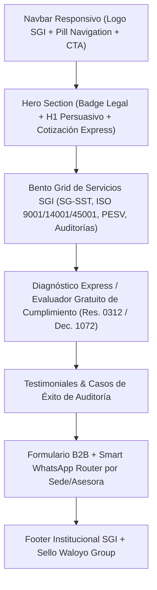

# 🏢 Plan Maestro — Gestión Integral SGI
## Propuesta Web B2B & Landing Comercial | Waloyo Group × SGI Unified Core

---

## 📎 Ficha Estratégica del Cliente

| Campo | Información Recopilada |
|---|---|
| **Nombre Comercial / Marca** | **Gestión Integral SGI** (Consultor SGI) |
| **Dominios Oficiales** | `gestionintegralsgi.com.co` / `consultorsgi.com` |
| **Core del Negocio** | Consultoría en Sistemas de Gestión Integrados (SG-SST, ISO 9001, ISO 14001, ISO 45001, PESV, Auditorías de Calidad y Cumplimiento Normativo en Colombia) |
| **Tipo de Cliente** | B2B (Atención a empresas clientes para auditorías y consultoría SST) |
| **Relación con Waloyo** | Cliente de Software Factory en Monorepo (`apps/client/SGI`) |
| **Ubicación del Proyecto** | Subproyecto en Monorepo: `apps/client/SGI` |
| **Alcance Inicial Aprobado** | **Landing Page Comercial B2B & Portal Informativo Institucional** (fase 1) |
| **Sistema de Diseño Oficial** | **SGI Unified Core** (`apps/client/SGI/platillas diseño/DESIGN.md`) |
| **Líderes y Contactos Clave** | • **María Elisa Arias Cortés** (Gerente - Asesora)   • **Milena Valencia López** (Directora Administrativa - Asesora)   • **Lesly Nayibe Vélez Álvarez** (Coordinadora - Asesora)   • **Laura Natali Tenorio Arias** (Analista / Asesora) |

---

## 🎨 Fase 1: Identidad Visual — SGI Unified Core

La identidad visual del proyecto SGI adopta formalmente la especificación **SGI Unified Core** definida en `apps/client/SGI/platillas diseño/DESIGN.md`:

### Paleta de Color Corporativa
- **Primary Blue (`#055bb2` / `#3b7ad3`)**: Color de acción principal para CTAs, estados activos y presencia de marca.
- **Secondary Navy (`#1e293b` / `#545f73`)**: Azul pizarra oscuro para titulares, estructura y footers.
- **Surface & Background (`#f7f9fb` / `#ffffff`)**: Jerarquía de blancos y grises fríos para tarjetas y secciones elevadas.
- **Semantic Colors**: Verde (#16A34A) para habilitaciones/cumplimiento, Rojo (#BA1A1A) para errores/alertas.

### Sistema Tipográfico
- **Titulares & Headings**: **`Manrope`** (700 Bold / 600 SemiBold) — Aporta un tono moderno, tecnológico y geométrico.
- **Cuerpo, Tablas & Formularios**: **`Inter`** (400 Regular / 600 SemiBold) — Máxima legibilidad B2B.

---

## 🧱 Fase 2: Arquitectura de la Landing Page Comercial B2B

### Secciones Clave
1. **Hero Section con Badge de Sello Legal**:
   - Titular impactante: *"Sistemas de Gestión Integrados. Cumplimiento legal del 100% sin fricción operativa."*
   - CTA doble: Agendar Evaluación Virtual / Consultar por WhatsApp.
2. **Bento Grid de Soluciones SGI**:
   - **SG-SST (Decreto 1072 & Res. 0312)**: Diseño, implementación y administración delegada.
   - **Normas ISO (9001, 14001, 45001)**: Auditorías de 1ª y 2ª parte y preparación para certificación.
   - **PESV (Res. 40595 / Ley 2251)**: Planes estratégicos de seguridad vial.
   - **Batería de Riesgo Psicosocial & Exámenes**: Diagnóstico ocupacional integral.
3. **Smart WhatsApp Router**:
   - Selector inteligente que dirige al usuario con la asesora correspondiente (Gerencia / Coordinación / Asesorías).

---

## 📱 Fase 3: Responsividad Mobile-First & Accesibilidad

- **Viewport Blindado**: Contenedor principal con `max-w-[1280px] mx-auto` y `overflow-x-hidden`.
- **Touch Targets**: Botones e inputs con `min-h-[44px]` y padding holgado para uso en smartphones por consultores e inspectores en campo.
- **Micro-interacciones**: Transiciones de 200ms en `transform` y `opacity` respetando `@media (prefers-reduced-motion: reduce)`.

---

## 🛡️ Fase 4: Legal & Compliance Colombia

- Cumplimiento de Ley 1581/2012 (Habeas Data) en formularios.
- Enlace en footer a términos y aviso de privacidad.
- NIT y certificación visibles.

---

## 🗓️ Fase 5: Cronograma de Implementación

| Sprint | Objetivos |
|---|---|
| **Sprint 1 (Andamiaje & UI)** | Setup React + Vite + Tailwind CSS v4 en `apps/client/SGI` aplicando el tema **SGI Unified Core** (`Manrope` + `Inter` + `#055bb2`). |
| **Sprint 2 (Componentes & Secciones)** | Desarrollo de Hero, Bento Grid de servicios y Evaluador Express de Cumplimiento. |
| **Sprint 3 (Conversión & QA)** | Integración de Smart WhatsApp Router, pruebas de responsive (320px+), build limpio (`npm run build`) y documentación. |

---

> **Desarrollado por Waloyo Group** — *Tecnología resiliente. Operación continua.*
