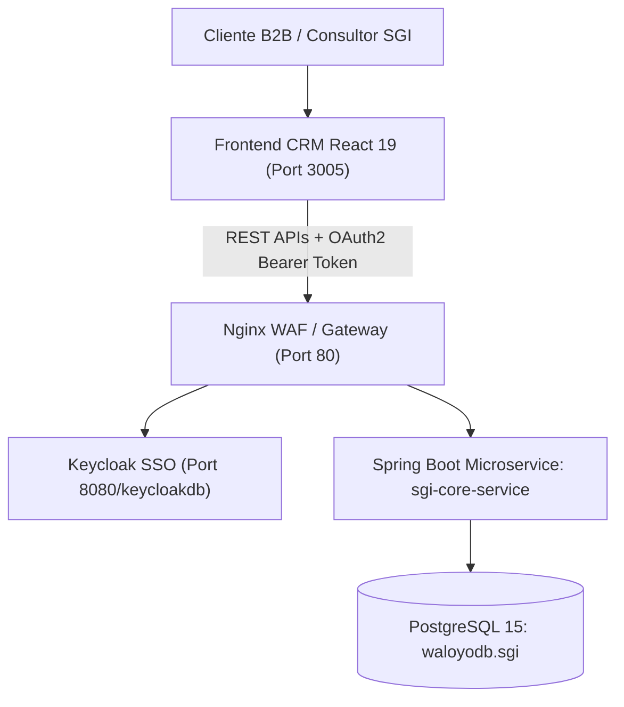

# 🏛️ Definición de Arquitectura: Microservicio Spring Boot vs. Frontend CRM React 19

---

## 1. Visión General de Desacoplamiento

Con base en la auditoría técnica de los sistemas legacy `AgendaSGI` y `ConsultorSGI`, la nueva plataforma empresarial de **Gestión Integral SGI** se divide bajo la **Arquitectura Híbrida de 5 Capas de Waloyo Group**:

---

## 2. Responsabilidades del Microservicio Backend (`sgi-core-service` - Spring Boot 3.x)

El microservicio backend será desarrollado en **Java 21 / Spring Boot 3.x** bajo **Arquitectura Hexagonal (Ports & Adapters)** y será responsable exclusivamente de la lógica de negocio, seguridad, almacenamiento y contratos API:

### A. Módulos y Dominio Hexagonal:
1. **`sgi-identity-domain`**:
   - Integración con **Keycloak OIDC**.
   - Validación de licencias de Salud Ocupacional (SST) de consultores y asignación de roles.
2. **`sgi-clients-domain`**:
   - CRUD de expediente único digital de clientes B2B (`terceros_clientes`).
   - Gestión de contratos vigentes (`contratos_b2b`), sedes y sistemas de gestión contratados.
3. **`sgi-agenda-domain`**:
   - Motor de programación de la agenda de asesores (`agenda_eventos`).
   - Reglas de validación contra traslapes de horario entre consultores.
   - Endpoints REST formateados para el calendario de FullCalendar (`EventosFullCalendarDTO`).
4. **`sgi-actas-domain`**:
   - Emisión de Actas Técnicas de Visita (`actas_visita`) con firma digitalizada Base64.
   - Motor de compromisos y alertas de vencimiento de actividades (`actividades_compromisos`).
5. **`sgi-auditoria-phva-domain`**:
   - Motor de calificación automática de los 60 Estándares Mínimos (**Res. 0312 de 2019**).
   - Diagnósticos de ciclo PHVA (Planear, Hacer, Verificar, Actuar) y normas ISO 9001/14001/45001.
   - Registro de hallazgos y No Conformidades (`auditorias_hallazgos_detalle`).
6. **`sgi-ausentismo-domain`**:
   - Registro de incapacidades médicas y cálculo automático de índices de accidentalidad laboral (**IF: Índice de Frecuencia**, **IS: Índice de Severidad** e **ILI**).

### B. Endpoints REST Principales que Proveerá Spring Boot:
- `GET /api/v1/sgi/dashboard/kpis`: Retorna métricas consolidadas (Clientes activos, auditorías en curso, % cumplimiento, pendientes).
- `GET /api/v1/sgi/agenda/eventos`: Retorna eventos de agenda en formato JSON para FullCalendar.
- `POST /api/v1/sgi/actas`: Crea acta de visita y genera compromisos derivados.
- `GET /api/v1/sgi/auditorias/resumen-phva`: Retorna matriz de cumplimiento normativo por cliente.

---

## 3. Responsabilidades del Frontend CRM (`apps/client/SGI/crm` - React 19)

El frontend CRM en React 19 actúa exclusivamente como la capa de presentación rica e interactiva (Single Page Application SPA):

### A. Vistas y Componentes UI:
1. **`Login.tsx`** ([Login.tsx](file:///D:/Waloyo/WaloyoGroup/apps/client/SGI/crm/src/pages/Login.tsx)): Formulario de autenticación SSO y sesión local.
2. **`Dashboard.tsx`** ([Dashboard.tsx](file:///D:/Waloyo/WaloyoGroup/apps/client/SGI/crm/src/pages/Dashboard.tsx)): Tablero de mando con KPI Cards, tabla de auditorías recientes con badges PHVA y widget de agenda.
3. **`ConsultorView.tsx`** ([ConsultorView.tsx](file:///D:/Waloyo/WaloyoGroup/apps/client/SGI/crm/src/pages/ConsultorView.tsx)): Módulo de auditorías y diagnósticos Res. 0312.
4. **`AgendaView.tsx`** ([AgendaView.tsx](file:///D:/Waloyo/WaloyoGroup/apps/client/SGI/crm/src/pages/AgendaView.tsx)): Módulo de calendario operativo de asesores.
5. **`Profile.tsx`** ([Profile.tsx](file:///D:/Waloyo/WaloyoGroup/apps/client/SGI/crm/src/pages/Profile.tsx)): Perfil de consultor y preferencias de notificación.

### B. Capa de Servicios y Estado (Axios / TanStack Query):
- `services/apiClient.ts`: Cliente HTTP Axios con interceptor Bearer Token.
- `services/agendaService.ts`: Consumo de eventos para FullCalendar.
- `services/auditoriaService.ts`: Consumo de informes de cumplimiento PHVA.

---

> **Waloyo Group Architecture Governance** — *Tecnología resiliente. Operación continua.*
