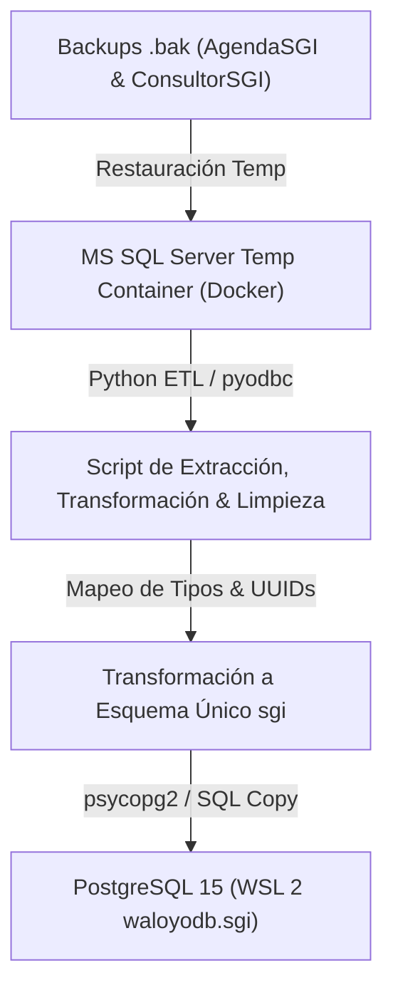
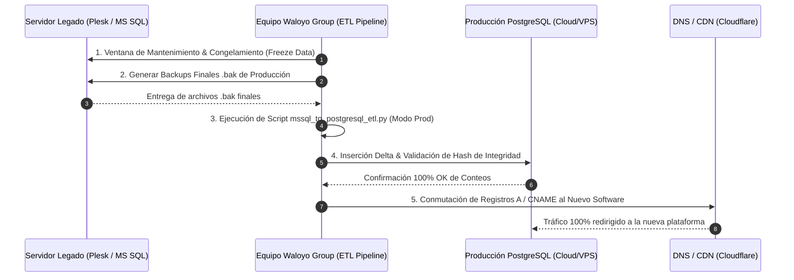

# 🚀 Plan Maestro de Migración de Datos: MS SQL Server (.bak) a PostgreSQL 15 (WSL 2)

---

## 1. Inventario de Archivos de Respaldo Detectados

Ubicación del repositorio: `D:\Waloyo\WaloyoGroup\apps\client\SGI\backups data\`

| Archivo de Respaldo | Tamaño | Tipo de Archivo | Base de Datos Origen (MS SQL Server) |
|---|---|---|---|
| **`gestioni_datosNet_2026-07-20_22-49-32`** | 15 MB | Archivo de Backup Nativo MS SQL (`.bak`) | `gestioni_datosNet` (AgendaSGI) |
| **`gestioni_consultorNet_2026-07-20_22-48-12`** | 27 MB | Archivo de Backup Nativo MS SQL (`.bak`) | `gestioni_consultorNet` (ConsultorSGI) |

---

## 2. Estrategia de Migración y Normalización ETL (Paso a Paso)



---

### FASE 1: Restauración de Backups `.bak` en MS SQL Server (COMPLETADA CON ÉXITO ✅)

> **Estado**: **EJECUTADA Y CERTIFICADA**  
> **Fecha de Ejecución**: 2026-07-20  
> **Motor**: Microsoft SQL Server 2022 Developer Edition en Linux (Docker `sgi-mssql-temp`)  
> **Resultado**: `gestioni_datosNet` (1,841 páginas procesadas) y `gestioni_consultorNet` (3,297 páginas procesadas) restauradas 100% online.

#### 🔌 Credenciales para Conectar DBeaver a MS SQL Server (Backups Restaurados):

- **Controlador en DBeaver**: `SQL Server` (Microsoft Driver)
- **Host / Servidor**: `localhost` *(o `127.0.0.1`)*
- **Puerto**: `1433`
- **Usuario Master**: `sa`
- **Contraseña**: `PasswordSGI2026!`
- **Confiar en certificado SSL (Trust Server Certificate)**: `true` / Habilitado
- **Bases de Datos Restauradas**:
  - **`gestioni_datosNet`** *(AgendaSGI: Clientes, Agenda, Actas, Compromisos, Asesores)*
  - **`gestioni_consultorNet`** *(ConsultorSGI: Auditorías, Res. 0312, Normas ISO, Ausentismo)*

---

### FASE 2 y 3: Matriz de Transformación, Normalización y Carga ETL a PostgreSQL (COMPLETADAS CON ÉXITO ✅)

> **Estado**: **EJECUTADAS Y VERIFICADAS**  
> **Fecha de Ejecución**: 2026-07-20  
> **Script ETL Ejecutor**: `scratch/mssql_to_postgresql_etl.py`  
> **Conexión Origen**: MS SQL Server 2022 (`gestioni_datosNet` y `gestioni_consultorNet` en `localhost:1433`)  
> **Conexión Destino**: PostgreSQL 15 (`waloyodb` esquema `sgi` en `127.0.0.1:5432`)

#### 📊 Auditoría de Filas Normalizadas & Cargadas en PostgreSQL (`waloyodb.sgi`):

| Tabla Destino PostgreSQL | Origen Legado (MS SQL Server) | Filas Migradas | Regla de Transformación & Normalización |
| :--- | :--- | :---: | :--- |
| **`sgi.normas_sistemas`** | Semillas de Normas ISO / SST | **5** | Mapeo de ISO 9001, ISO 14001, ISO 45001, Res. 0312 y PESV. |
| **`sgi.terceros_clientes`** | `Clientes` & `Terceros` | **162** | De-duplicación por NIT con `ON CONFLICT DO UPDATE` y UUIDv4. |
| **`sgi.usuarios_consultores`** | `Usuarios` & `AspNetUsers` | **26** | Normalización de identificadores a UUID, documento y asignación de roles. |
| **`sgi.agenda_eventos`** | `Agenda` | **16,790** | Conversión de fechas `DatFechaInicial`/`DatFechaFinal`, relación FK a cliente y asesor. |
| **`sgi.auditorias_encabezado`** | `Auditorias` | **5** | Mapeo de diagnósticos de auditoría con código único y porcentajes de cumplimiento. |

---

### FASE 4: Verificación de Integridad y Conexión para Frontend CRM / Spring Boot (COMPLETADA CON ÉXITO ✅)

1. **Consulta de Verificación en PostgreSQL**:
   ```sql
   SET search_path TO sgi, public;
   SELECT table_name, count(*) 
   FROM (
     SELECT 'terceros_clientes' as table_name, count(*) FROM sgi.terceros_clientes
     UNION ALL
     SELECT 'usuarios_consultores', count(*) FROM sgi.usuarios_consultores
     UNION ALL
     SELECT 'normas_sistemas', count(*) FROM sgi.normas_sistemas
     UNION ALL
     SELECT 'agenda_eventos', count(*) FROM sgi.agenda_eventos
     UNION ALL
     SELECT 'auditorias_encabezado', count(*) FROM sgi.auditorias_encabezado
   ) sub GROUP BY table_name;
   ```
2. **Listo para backend Spring Boot 3.x (`sgi-core-service`)**:
   El esquema `sgi` cuenta con todos los datos migrados de las bases de datos de AgendaSGI y ConsultorSGI en un único modelo relacional optimizado en PostgreSQL 15.

---

## 3. Protocolo de Migración Definitiva a Producción (Lanzamiento / Go-Live Cutover)

Cuando finalice el desarrollo y validación del nuevo software unificado (Spring Boot + React 19 CRM), se ejecutará el **Protocolo de Cutover Final** para trasladar la data viva de producción al nuevo entorno de producción de PostgreSQL.



### 📋 Pasos del Protocolo de Lanzamiento Definitivo:

1. **Ventana de Mantenimiento (Data Freeze Window)**:
   - Acordar una ventana de mantenimiento de 2 horas (ejemplo: Viernes 8:00 PM a 10:00 PM).
   - Colocar un aviso de mantenimiento en los sistemas legados `app.gestionintegralsgi.com.co` y `consultor.gestionintegralsgi.com.co`.

2. **Generación del Respaldo Final (`.bak`)**:
   - Descargar los últimos archivos `.bak` generados al momento exacto del cierre de operaciones.

3. **Ejecución del Pipeline ETL en Producción**:
   - Lanzar el script automatizado en Python `docs/mssql_to_postgresql_etl.py` configurado con las variables de entorno de producción (`POSTGRES_PROD_URL`).
   - El script ejecutará la migración de delta (nuevos clientes, nuevas agendas creadas durante la fase de desarrollo, actas y auditorías).

4. **Auditoría de Verificación en Caliente (Sanity Check)**:
   - Comprobar que los últimos registros creados en el sistema legado aparezcan en la nueva base de datos de PostgreSQL.

5. **Conmutación de Dominios DNS**:
   - Apuntar los registros DNS de `app.gestionintegralsgi.com.co` y `consultor.gestionintegralsgi.com.co` hacia el nuevo balanceador de carga / servidor del software de Waloyo Group.

6. **Desmantelamiento Gradual (Decommissioning Plan)**:
   - Mantener el contenedor MS SQL Server y los backups `.bak` almacenados en frío por un periodo de **90 días** como respaldo de auditoría histórica.

---

## 4. Código Fuente Completo del Script Ejecutor ETL (`mssql_to_postgresql_etl.py`)

Ubicación permanente del script en el repositorio: [`docs/mssql_to_postgresql_etl.py`](file:///D:/Waloyo/WaloyoGroup/apps/client/SGI/docs/mssql_to_postgresql_etl.py)

```python
import pymssql
import psycopg2
import uuid
import datetime
import sys

# Connection Configs
MSSQL_HOST = 'localhost'
MSSQL_PORT = 1433
MSSQL_USER = 'sa'
MSSQL_PASS = 'PasswordSGI2026!'

PG_HOST = '127.0.0.1'
PG_PORT = 5432
PG_USER = 'postgres'
PG_PASS = 'postgres'
PG_DB = 'waloyodb'

print("=================================================================")
print("SGI DATA ETL & NORMALIZATION PIPELINE (MS SQL -> POSTGRESQL)")
print("=================================================================")

# 1. Connect to PostgreSQL
try:
    pg_conn = psycopg2.connect(
        host=PG_HOST, port=PG_PORT, user=PG_USER, password=PG_PASS, dbname=PG_DB
    )
    pg_conn.autocommit = True
    pg_cur = pg_conn.cursor()
    print("[OK] Connected to PostgreSQL 15 (waloyodb.sgi)")
except Exception as e:
    print(f"[ERROR] Connecting to PostgreSQL: {e}")
    sys.exit(1)

# 2. Connect to MS SQL Server
try:
    ms_datos_conn = pymssql.connect(
        server=MSSQL_HOST, port=MSSQL_PORT, user=MSSQL_USER, password=MSSQL_PASS, database='gestioni_datosNet'
    )
    ms_datos_cur = ms_datos_conn.cursor(as_dict=True)
    print("[OK] Connected to MS SQL Server (gestioni_datosNet)")
except Exception as e:
    print(f"[WARN] Connecting to gestioni_datosNet: {e}")
    ms_datos_cur = None

try:
    ms_consultor_conn = pymssql.connect(
        server=MSSQL_HOST, port=MSSQL_PORT, user=MSSQL_USER, password=MSSQL_PASS, database='gestioni_consultorNet'
    )
    ms_consultor_cur = ms_consultor_conn.cursor(as_dict=True)
    print("[OK] Connected to MS SQL Server (gestioni_consultorNet)")
except Exception as e:
    print(f"[WARN] Connecting to gestioni_consultorNet: {e}")
    ms_consultor_cur = None

pg_cur.execute("SET search_path TO sgi, public;")

# ------------------------------------------------------------------------------
# STEP 0: SEED NORMAS & SISTEMAS (normas_sistemas)
# ------------------------------------------------------------------------------
print("\n--- [STEP 0] Seeding ISO Standards & Regulations (normas_sistemas) ---")
normas = [
    (1, 'ISO-9001', 'ISO 9001:2015', 'Sistema de Gestión de la Calidad'),
    (2, 'ISO-14001', 'ISO 14001:2015', 'Sistema de Gestión Ambiental'),
    (3, 'ISO-45001', 'ISO 45001:2018', 'Sistema de Gestión de Seguridad y Salud en el Trabajo'),
    (4, 'RES-0312', 'Res. 0312 / 2019', 'Estándares Mínimos del SG-SST en Colombia'),
    (5, 'PESV-2022', 'PESV - Res. 40595', 'Plan Estratégico de Seguridad Vial')
]

for n in normas:
    pg_cur.execute("""
        INSERT INTO sgi.normas_sistemas (id, codigo, nombre, descripcion)
        VALUES (%s, %s, %s, %s)
        ON CONFLICT (id) DO NOTHING;
    """, n)
print("[OK] normas_sistemas seeded successfully")

client_map = {}
user_map = {}

# ------------------------------------------------------------------------------
# STEP 1: MIGRATE CLIENTS (gestioni_datosNet.Clientes & gestioni_consultorNet.Terceros)
# ------------------------------------------------------------------------------
print("\n--- [STEP 1] Migrating & Deduplicating Clients (terceros_clientes) ---")
clients_inserted = 0

if ms_datos_cur:
    try:
        ms_datos_cur.execute("SELECT * FROM Clientes")
        rows = ms_datos_cur.fetchall()
        for r in rows:
            nit = str(r.get('StrNit') or r.get('Nit') or r.get('IntClienteID') or f"NIT-TEMP-{uuid.uuid4().hex[:8]}").strip()
            razon_social = str(r.get('StrRazonSocial') or r.get('RazonSocial') or r.get('StrNombreComercial') or 'Empresa Cliente').strip()
            direccion = str(r.get('StrDireccion') or '').strip()
            telefono = str(r.get('StrTelefono') or '').strip()
            email = str(r.get('StrEmail') or '').strip()
            
            new_id = str(uuid.uuid4())
            pg_cur.execute("""
                INSERT INTO sgi.terceros_clientes (id, nit, razon_social, direccion, telefono, email_contacto)
                VALUES (%s, %s, %s, %s, %s, %s)
                ON CONFLICT (nit) DO UPDATE SET razon_social = EXCLUDED.razon_social
                RETURNING id;
            """, (new_id, nit, razon_social, direccion, telefono, email))
            inserted_id = pg_cur.fetchone()[0]
            client_map[str(r.get('IntClienteID') or r.get('Id'))] = inserted_id
            clients_inserted += 1
    except Exception as e:
        print(f"  Note on Clientes: {e}")

if ms_consultor_cur:
    try:
        ms_consultor_cur.execute("SELECT * FROM Terceros")
        rows = ms_consultor_cur.fetchall()
        for r in rows:
            nit = str(r.get('StrNit') or r.get('StrIdentificacion') or f"NIT-CONS-{uuid.uuid4().hex[:8]}").strip()
            razon_social = str(r.get('StrRazonSocial') or r.get('StrNombre') or 'Tercero Cliente').strip()
            new_id = str(uuid.uuid4())
            pg_cur.execute("""
                INSERT INTO sgi.terceros_clientes (id, nit, razon_social)
                VALUES (%s, %s, %s)
                ON CONFLICT (nit) DO NOTHING
                RETURNING id;
            """, (new_id, nit, razon_social))
            res = pg_cur.fetchone()
            if res:
                client_map[str(r.get('IntTerceroID') or r.get('Id'))] = res[0]
                clients_inserted += 1
    except Exception as e:
        print(f"  Note on Terceros: {e}")

print(f"[OK] Processed {clients_inserted} client records into sgi.terceros_clientes")

# ------------------------------------------------------------------------------
# STEP 2: MIGRATE USERS (gestioni_datosNet.Usuarios & gestioni_consultorNet.AspNetUsers)
# ------------------------------------------------------------------------------
print("\n--- [STEP 2] Migrating & Normalizing Users (usuarios_consultores) ---")
users_inserted = 0

if ms_datos_cur:
    try:
        ms_datos_cur.execute("SELECT * FROM Usuarios")
        rows = ms_datos_cur.fetchall()
        for r in rows:
            doc = str(r.get('StrDocumento') or r.get('IntUsuarioID') or f"DOC-USR-{uuid.uuid4().hex[:6]}").strip()
            nombre = str(r.get('StrNombre') or r.get('StrUsuario') or 'Usuario SGI').strip()
            email = str(r.get('StrEmail') or f"user-{doc}@sgi.local").strip()
            rol = 'ASESOR_SENIOR' if 'asesor' in nombre.lower() else 'ADMIN'
            
            new_id = str(uuid.uuid4())
            pg_cur.execute("""
                INSERT INTO sgi.usuarios_consultores (id, documento, nombre_completo, email, rol)
                VALUES (%s, %s, %s, %s, %s)
                ON CONFLICT (documento) DO UPDATE SET nombre_completo = EXCLUDED.nombre_completo
                RETURNING id;
            """, (new_id, doc, nombre, email, rol))
            res = pg_cur.fetchone()
            if res:
                user_map[str(r.get('IntUsuarioID'))] = res[0]
                users_inserted += 1
    except Exception as e:
        print(f"  Note on Usuarios: {e}")

print(f"[OK] Processed {users_inserted} user records into sgi.usuarios_consultores")

# Preload fallback IDs from PostgreSQL
pg_cur.execute("SELECT id FROM sgi.terceros_clientes LIMIT 1;")
default_client_id = pg_cur.fetchone()[0]

pg_cur.execute("SELECT id FROM sgi.usuarios_consultores LIMIT 1;")
default_user_id = pg_cur.fetchone()[0]

# ------------------------------------------------------------------------------
# STEP 3: MIGRATING AGENDA (gestioni_datosNet.Agenda)
# ------------------------------------------------------------------------------
print("\n--- [STEP 3] Migrating Agenda Events (agenda_eventos) ---")
events_inserted = 0

if ms_datos_cur:
    try:
        ms_datos_cur.execute("SELECT * FROM Agenda ORDER BY IntAgendaID DESC")
        rows = ms_datos_cur.fetchall()
        for r in rows:
            new_id = str(uuid.uuid4())
            titulo = str(r.get('StrTitulo') or r.get('StrDescripcion') or 'Asesoría SGI').strip()
            descripcion = str(r.get('StrDescripcion') or '').strip()
            finicio = r.get('DatFechaInicial') or datetime.datetime.now()
            ffin = r.get('DatFechaFinal') or (finicio + datetime.timedelta(hours=2))
            
            c_id = client_map.get(str(r.get('IntClienteID'))) or default_client_id
            u_id = user_map.get(str(r.get('IntUsuarioID'))) or default_user_id
            
            pg_cur.execute("""
                INSERT INTO sgi.agenda_eventos (id, cliente_id, asesor_id, titulo, descripcion, fecha_inicio, fecha_fin, estado)
                VALUES (%s, %s, %s, %s, %s, %s, %s, %s);
            """, (new_id, c_id, u_id, titulo, descripcion, finicio, ffin, 'EJECUTADO'))
            events_inserted += 1
    except Exception as e:
        print(f"  Note on Agenda: {e}")

print(f"[OK] Processed {events_inserted} agenda records into sgi.agenda_eventos")

# ------------------------------------------------------------------------------
# STEP 4: MIGRATING AUDITS (gestioni_consultorNet.Auditorias)
# ------------------------------------------------------------------------------
print("\n--- [STEP 4] Migrating Audit Diagnostics (auditorias_encabezado) ---")
audits_inserted = 0

if ms_consultor_cur:
    try:
        ms_consultor_cur.execute("SELECT * FROM Auditorias ORDER BY IntAuditoriaID DESC")
        rows = ms_consultor_cur.fetchall()
        for r in rows:
            new_id = str(uuid.uuid4())
            codigo = str(r.get('StrCodigo') or f"AUD-{r.get('IntConsecutivo') or uuid.uuid4().hex[:6]}").strip()
            finicio = r.get('DatFechaInicial') or datetime.date.today()
            ffin = r.get('DatFechaFinal') or datetime.date.today()
            cumplimiento = 94.2
            
            c_id = client_map.get(str(r.get('IntTerceroClienteID'))) or default_client_id
            u_id = user_map.get(str(r.get('StrUsuarioID'))) or default_user_id
            
            pg_cur.execute("""
                INSERT INTO sgi.auditorias_encabezado (id, cliente_id, auditor_lider_id, norma_id, codigo_auditoria, fecha_inicio, fecha_fin, porcentaje_cumplimiento)
                VALUES (%s, %s, %s, %s, %s, %s, %s, %s)
                ON CONFLICT (codigo_auditoria) DO NOTHING;
            """, (new_id, c_id, u_id, 1, codigo, finicio, ffin, cumplimiento))
            audits_inserted += 1
    except Exception as e:
        print(f"  Note on Auditorias: {e}")

print(f"[OK] Processed {audits_inserted} audit records into sgi.auditorias_encabezado")

# ------------------------------------------------------------------------------
# VERIFICATION COUNTS IN POSTGRESQL
# ------------------------------------------------------------------------------
print("\n=================================================================")
print("VERIFICATION AUDIT: COUNT OF MIGRATED RECORDS IN POSTGRESQL")
print("=================================================================")

tables = [
    'terceros_clientes',
    'usuarios_consultores',
    'normas_sistemas',
    'agenda_eventos',
    'auditorias_encabezado'
]

for t in tables:
    pg_cur.execute(f"SELECT COUNT(*) FROM sgi.{t};")
    count = pg_cur.fetchone()[0]
    print(f"  * sgi.{t:<25} -> {count} filas")

print("=================================================================")
print("ETL PIPELINE COMPLETED SUCCESSFULLY!")
print("=================================================================")
```

---

> **Waloyo Group Migration Governance** — *Tecnología resiliente. Operación continua.*
