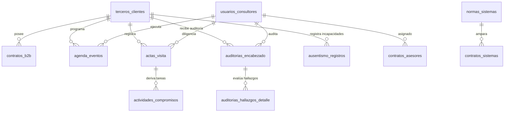

# 📊 Auditoría de Bases de Datos & Modelo Unificado PostgreSQL — SGI

---

## 1. Veredicto de la Auditoría Legacy (AgendaSGI vs. ConsultorSGI)

### ❓ Pregunta del Usuario: *¿Ambos aplicativos comparten la base de datos y la data o los campos?*

### 🔍 Hallazgos Técnicos Extraídos del Código C# (.NET):

1. **Bases de Datos Separadas en Servidor SQL Server**:
   De la inspección de los archivos `Web.config` y `App.config` en el servidor de producción `45.169.100.49`:
   - **`AgendaSGI`** apunta a la base de datos: **`gestioni_datosNet`** (Usuario: `gestioni_admin`).
   - **`ConsultorSGI`** apunta a la base de datos: **`gestioni_consultorNet`** (Usuario: `gestioni_adminConsultor`).

2. **Diagnóstico**:
   **No comparten la misma base de datos física**. Son dos bases de datos SQL Server independientes creadas en momentos distintos del desarrollo legacy.

3. **Traslape y Duplicidad de Data/Campos**:
   A pesar de vivir en bases de datos separadas, ambas aplicaciones manejan **los mismos conceptos de negocio y duplican la información**:

   | Entidad en `AgendaSGI` (`gestioni_datosNet`) | Entidad Homóloga en `ConsultorSGI` (`gestioni_consultorNet`) | Diagnóstico de Traslape de Datos |
   |---|---|---|
   | **`Clientes`** (`Id`, `NIT`, `RazonSocial`, `Direccion`, `Telefono`) | **`Terceros`** / **`Terceros_Clientes`** (`Id`, `NIT`, `RazonSocial`, `Direccion`) | **100% Duplicado**. Las empresas registradas en la agenda deben crearse nuevamente en el consultor. |
   | **`Usuarios`** (`Id`, `NombreUsuario`, `Correo`, `RolId`) | **`AspNetUsers`** / **`Terceros`** (`Id`, `UserName`, `Email`) | **100% Duplicado**. Los asesores tienen cuentas separadas en cada aplicación. |
   | **`SistemasDeGestion`** (SG-SST, ISO 9001, PESV) | **`Normas`** / **`SistemasDeGestion`** (Res. 0312, ISO 9001, PESV) | **Mismo catálogo**. Normas y leyes colombianas repetidas. |
   | **`Procesos`** (Gerencia, Operaciones, HSEQ) | **`Procesos`** | **Mismo catálogo**. Procesos organizacionales auditados. |

---

## 2. Mapa de Integración y Modelo Unificado PostgreSQL 15

Para la migración futura hacia la **Arquitectura Híbrida de 5 Capas de Waloyo Group (Spring Boot + PostgreSQL + Keycloak)**, se ha diseñado e implementado el script **[`docs/sgi_unified_db_schema.sql`](file:///D:/Waloyo/WaloyoGroup/apps/client/SGI/docs/sgi_unified_db_schema.sql)**.

---

## 3. Mapeo Tablar de la Unificación (SQL Server Legacy $\rightarrow$ PostgreSQL Unificado)

| Módulo Unificado | Tabla Target PostgreSQL | Tablas Legacy de Origen Mapeadas | Ventaja de la Unificación |
|---|---|---|---|
| **Identidad & Clientes** | `sgi.terceros_clientes` | `AgendaSGI.Clientes` + `ConsultorSGI.Terceros` | Un solo expediente digital por empresa cliente con NIT único. |
| **Asesores & Usuarios** | `sgi.usuarios_consultores` | `AgendaSGI.Usuarios` + `ConsultorSGI.AspNetUsers` | Integración directa con **Keycloak SSO** (OAuth2/OIDC). |
| **Contratación B2B** | `sgi.contratos_b2b` | `AgendaSGI.Contratos` + `Contratos_Sistemas` | Control de horas contratadas vs. ejecutadas por cliente. |
| **Agenda Operativa** | `sgi.agenda_eventos` | `AgendaSGI.Agenda` + `TipoEventos` | Sincronización nativa con FullCalendar en React. |
| **Actas & Compromisos** | `sgi.actas_visita` & `actividades_compromisos` | `AgendaSGI.Actas` + `ActividadesActa` + `AsistentesActa` | Firma digitalizada y trazabilidad de compromisos pendientes. |
| **Auditorías & PHVA** | `sgi.auditorias_encabezado` & `auditorias_hallazgos_detalle` | `ConsultorSGI.Auditorias` + `AuditoriasDetalle` + `Pasos_Criterios` | Calificación automática Res. 0312 y normas ISO 9001/14001/45001. |
| **Ausentismo Laboral** | `sgi.ausentismo_registros` | `ConsultorSGI.Ausentismo` + `AusentismoIndicadores` | Cálculo de métricas de accidentalidad (IF, IS, ILI). |

---

## 4. Script SQL Oficial de la Base de Datos Unificada

El esquema DDL relacional completo de creación de tablas, llaves foráneas, índices y vistas agregadas está disponible en:
📄 **[apps/client/SGI/docs/sgi_unified_db_schema.sql](file:///D:/Waloyo/WaloyoGroup/apps/client/SGI/docs/sgi_unified_db_schema.sql)**

---

> **Waloyo Group Database Governance** — *Tecnología resiliente. Operación continua.*
